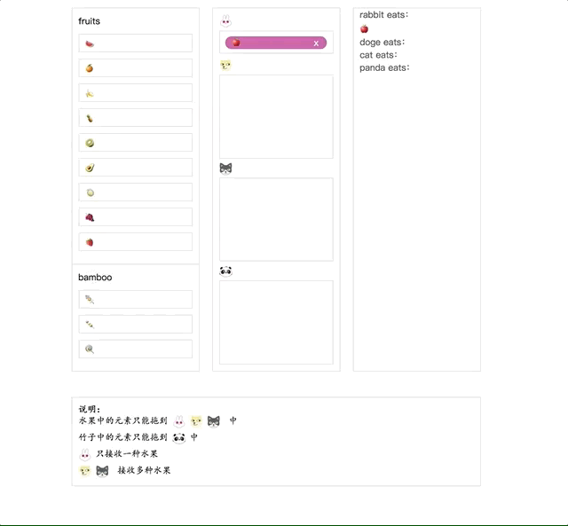
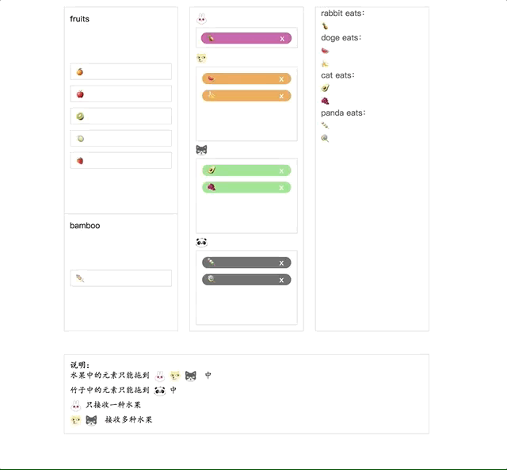

## React-dnd-Demo
基于[react-dnd](https://github.com/react-dnd/react-dnd)实现的可拖拽的例子。

A demo that supports drag and drag, based on [react-dnd](https://github.com/react-dnd/react-dnd).

### 预览

### todos
- 拖动左侧元素时，显示可drop的对象
- 拖动时将被拖动元素放大显示
